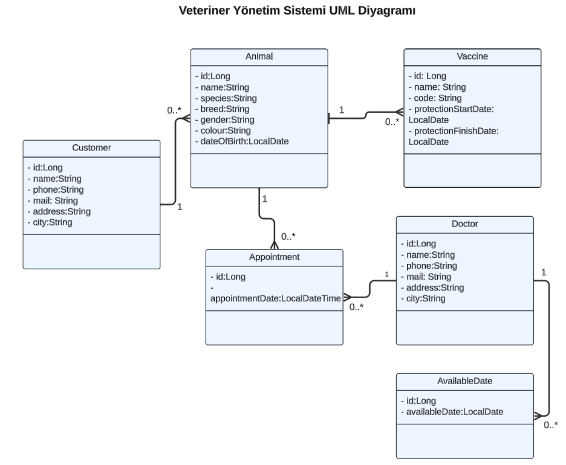

# VeterinaryManagementSystem

 - Veterinary Management System API
===============================================

## Table of Contents

- [About](#about)
- [API](#api)
- [Request Body Templates](#request-body-templates)
  - [Animal](#animal)
  - [Customer](#customer)
  - [Doctor](#doctor)
  - [Vaccine](#vaccine)
  - [Appointment](#appointment)
  - [AvailableDay](#availableday)


## About

It is a RESTful API which is written in Java and Spring Boot.


## API

### Animal

| HTTP Method | HTTP Path                   | Action             |
|-------------|-----------------------------|--------------------|
| `GET`       | `/api/v1/animals`              | get animals by paging  |
| `GET`       | `/api/v1/animals/{id}`         | get animals by id      |
| `GET`       | `/api/v1/animals/name/{name}`  | search animals by name |
| `POST`      | `/api/v1/animals/post`         | add new animals        |
| `PUT`       | `/api/v1/animals/update`       | update animals         |
| `DELETE`    | `/api/v1/animals/{id}`         | delete animals         |

### Customer

| HTTP Method | HTTP Path                  | Action               |
|-------------|----------------------------|----------------------|
| `GET`       | `/api/customers`                     | get customers by paging    |
| `GET`       | `/api/customers/{customerId}`        | get customer by id  |
| `GET`       | `/api/customers/animals{customerId}` | get animals by id   |
| `GET`       | `/api/customers/name/{name}`         | get customer by name|
| `POST`      | `/api/customers/`                    | add new customer    |
| `PUT`       | `/api/customers/`                    | updatecustomer      |
| `DELETE`    | `/api/customers/{id}`                | delete customer     |

### Doctor

| HTTP Method | HTTP Path        | Action        |
|-------------|------------------|---------------|
| `GET`       | `/api/v1/doctors`            | get  doctors by paging  |
| `GET`       | `/api/v1/doctors/{doctorId}` | get doctor by id |
| `POST`      | `/api/v1/doctors/`           | add new doctor   |
| `PUT`       | `/api/v1/doctors/`           | update doctor    |
| `DELETE`    | `/api/v1/doctors/{doctorId}` | delete doctor    |

### Vaccine

| HTTP Method | HTTP Path                                                               | Action                                   |
|-------------|-------------------------------------------------------------------------|------------------------------------------|
| `GET`       | `/api/v1/vaccine`                                                          | get vaccines by paging                     |
| `GET`       | `/api/v1/vaccine/{id}`                                                     | get vaccine by id                          |
| `GET`       | `/api/v1/vaccine/animals-in-vaccination-range`                             |  get vaccines ending in the given period   |
| `GET`       | `/api/v1/vaccine/animal/{animal_id}`                                       | get all vaccines administered to the animal|
| `POST`      | `/api/v1/vaccine/post`                                                     | add new vaccination to the pet             |
| `PUT`       | `/api/v1/vaccine/`                                                         | update vaccination                         |
| `DELETE`    | `/api/v1/vaccine/delete/{vaccineId}`                                       | delete vaccination                         |

### Appointments

| HTTP Method | HTTP Path                                               | Action                                      |
|-------------|---------------------------------------------------------|---------------------------------------------|
| `GET`       | `/api/appointments`                                     | get  appointments by paging                    |
| `GET`       | `/api/appointments/v1/by-doctor-and-date-range/`        | get appointments of doctor in the given period |
| `GET`       | `/api/appointments/v1/by-animal-and-date-range/`        | get appointments of animal in the given period |
| `POST`      | `/api/appointments/post`                                | add new appointment                            |
| `PUT`       | `/api/appointments/`                                    | update appointment                             |
| `DELETE`    | `/api/appointments/delete{appointment_id}`              | delete appointment                             |

### AvailableDay

| HTTP Method | HTTP Path                      | Action            |
|-------------|--------------------------------|-------------------|
| `GET`       | `/api/v1/dates`                 | get  availabledate  by paging   |
| `GET`       | `/api/v1/dates/{id}`            | get availabledate  by id        |
| `POST`      | `/api/v1/dates/`                | add new availabledate           |
| `PUT`       | `/api/v1/dates/`                | update availabledate            |
| `DELETE`    | `/api/v1/dates/delete{date_id}` | delete availabledate            |

---
### UML
0">


## Request Body Templates

### Animal


```json
{
  "id": null,
  "name": "string",
  "species": "string",
  "breed": "string",
  "gender": "string",
  "color": "string",
  "birthDate": "yyyy-MM-dd",
  "customerId": null
}
```

### Customer

```json
{
  "id": null,
  "name": "string",
  "phone": "string",
  "email": "string",
  "address": "string",
  "city": "string"
}
```

### Doctor

```json
{
  "id": null,
  "name": "string",
  "phone": "string",
  "email": "string",
  "address": "string",
  "city": "string"
}
```

### Vaccine

```json
{
  "id": null,
  "name": "string",
  "code": "string",
  "protectionStartDate": "yyyy-MM-dd",
  "protectionEndDate": "yyyy-MM-dd",
  "animal_id": null
}
```

### Appointment

```json
{
  "id": null,
  "appointmentDateTime": "yyyy-MM-dd HH:mm",
  "doctorId": null,
  "animal_id": null
}
```

### AvaialableDay

```json
{
  "id": null,
  "available_date": "yyyy-MM-dd",
  "animal_id": null
}
```

### API Key Features

Management of Animals and Owners (Customers)

Registering, updating, viewing, and deleting information about animals

Registering, updating, viewing, and deleting information about animal owners

Filtering animal owners by name

Filtering animals by name

Viewing all animals registered to a specific animal owner in the system

Management of Administered Vaccines

Recording, updating, viewing, and deleting information about vaccines administered to animals

System does not allow entry of a new vaccine if the protection expiration date of the same type of vaccine (same name and code) for the patient has not passed yet

Listing all vaccine records for a specific animal based on the animal's id

Listing animals with approaching vaccine protection expiration dates based on the start and end dates entered by the user

### Appointment Management

Creating, updating, viewing, and deleting appointments for vaccine and examination of animals

Appointments are recorded in the system with date and time

Appointments for various examinations of animals by doctors should be scheduled on suitable dates and times. Only one appointment per hour can be created for each doctor.

Availability of the doctor on the entered date can be viewed when creating an appointment.

Appointments can be filtered by the date range and the doctor entered by the user.

Appointments can be filtered by the date range and the animal entered by the user.

### Management of Veterinary Doctors

Registering, updating, viewing, and deleting information about veterinary doctors

Management of Doctors' Available Days

Adding, updating, viewing, and deleting available days for doctors
